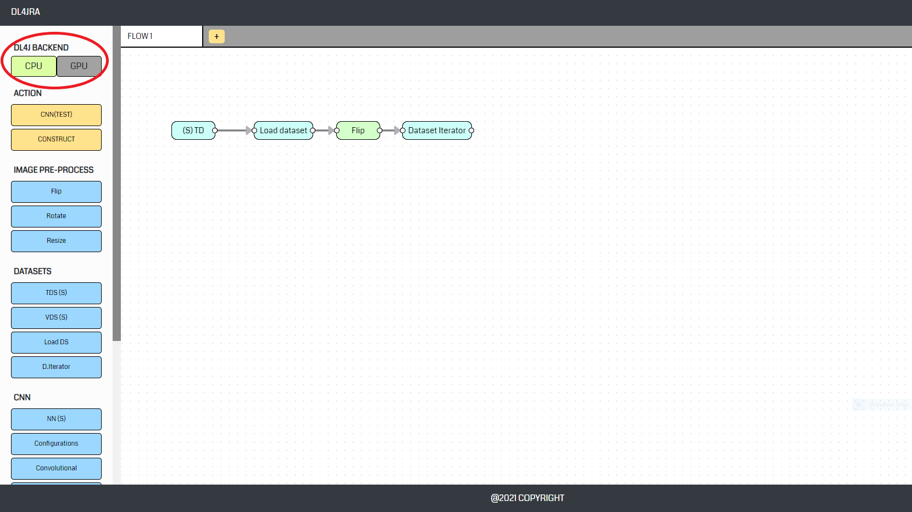
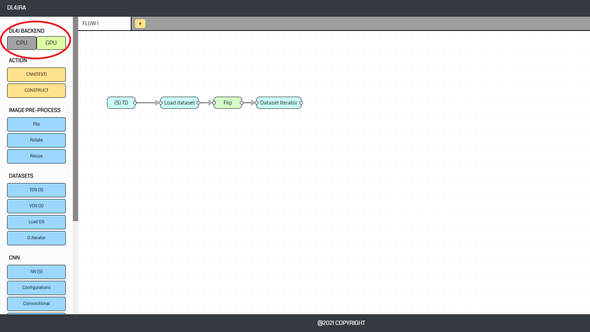
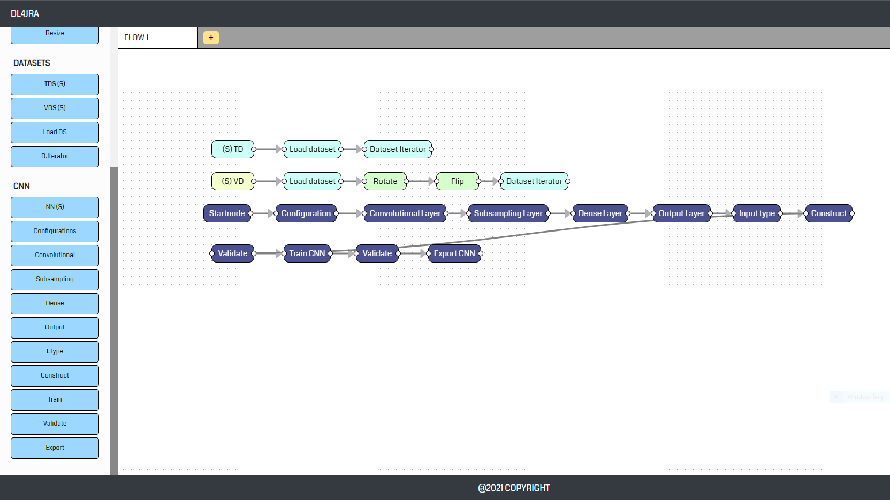

<!-- omit in toc -->
# **DL4JRA**
The purpose of developing DL4JRA is to allow everyone, including those who have no programming skill, to have a chance to try on Deep Learning.

<!-- omit in toc -->
## **Preparation**
- [x] Clone or download the DL4JRA repository from GitHub.
- [x] Install the latest version of [Eclipse](https://www.eclipse.org/downloads/).
- [x] Go to [Oracle Java Archive]((https://www.oracle.com/java/technologies/javase/javase8-archive-downloads.html)) and install Java SE 8
- [x] Download [OpenCV 4.5.3](https://opencv.org/opencv-4-5-3/) 
- [x] Import server folder as maven project in Eclipse
- [x]  Install [OpenCV for Java](https://opencv-java-tutorials.readthedocs.io/en/latest/01-installing-opencv-for-java.html)
- [x] Download and install [Node.js](https://nodejs.org/en/download/)
- [x] Navigate to "client" directory and install all dependencies
```
> cd DL4JRA/client
> npm install
```
<br>

<!-- omit in toc -->
## **Launch application**
<!-- omit in toc -->
### **Server (SpringBoot)**
```
> cd DL4JRA/server
> mvn spring-boot:run
```
<!-- omit in toc -->
### **Client (ReactJS)**
```
> cd DL4JRA/client
> npm start
```

<!-- omit in toc -->
## **DL4JRA Features**
- [**CPU/GPU Backend Switching**](#cpugpu-backend-switching)
- [**Dataset Generation Through Webcam**](#dataset-generation-through-webcam)
- [**Convolution Neural Network**](#convolution-neural-network)
- [**Object Detection using Pretrained Model**](#object-detection-using-pretrained-model)
- [**Object Classification Deployment**](#object-classification-deployment)
- [**MQTT Signalling and Output**](#mqtt-signalling-and-output)
<br><br>


## **CPU/GPU Backend Switching**
For enabling different backends at runtime, users can set the priority with the environment via environment variable
<!-- omit in toc -->
### **Windows (cmd)**
```
> SETX BACKEND_PRIORITY_CPU (NUMBER)
> SETX BACKEND_PRIORITY_GPU (NUMBER)
```
To check which backend is used, the simplest approach is to look the at the "Backend section" located in "CNN", "Object Detection" and "Object Classification" page.

<p align='center'>
    <kbd></kbd>
    <kbd></kbd>
</p>
<br><br>

## **Dataset Generation Through Webcam**
Watch a [DEMO](https://drive.google.com/file/d/1wDlsO9H4agwKgXQEYtUcKj568qrJj8q6/view?usp=sharing) about dataset generation using DL4JRA.
1. Navigate to "GENERATE DATASET" section from main page.
2. Configure the dimension (width & height) of images, number of image to take and the location (directory) to save.
3. Select a camera/webcam/video source.
4. Click on Screenshot button.
<br><br>

## **Convolution Neural Network**
Watch a [DEMO](https://drive.google.com/file/d/1ry6vZewW2sjsE2jFZlEQir1QS5roK-L9/view?usp=sharing) about construct, train and validate convolution neural network using DL4JRA.
1. Navigate to "CONVOLUTION NEURAL NETWORK" section from the main page.
<!-- omit in toc -->
### **Load Training Dataset**
1. Start a sequence with a <b>TD(S)</b> node.
2. Followed by a <b>Load Dataset</b> node.
3. End the sequence with a <b>D.Iterator</b> node.
   ```
   TD(S) --> Load DS --> (Image preprocess nodes) --> D.Iterator
   ```
<!-- omit in toc -->
### **Load Validation Dataset**
1. Start a sequence with a <b>VD(S)</b> node.
2. Followed by a <b>Load Dataset</b> node.
3. End the sequence with a <b>D.Iterator</b> node.
    ```
    VD(S) --> Load DS --> (Image preprocess nodes) --> D.Iterator
    ```
<!-- omit in toc -->
### **Construct, Train & Validate CNN**
1. Start a sequence with a <b>NN(S)</b> node.
2. Followed by a <b>Configurations</b> node.
3. End the sequence with <b>I.Type</b> and <b>Construct</b> node.
4. To train, validate and export model, add these nodes <b>AFTER the CONSTRUCT</b> node.
    ```
    NN(S) --> Configurations --> (Layers) --> I.Type --> Construct --> (Train/Validate/Export)
    ```
<!-- omit in toc -->
### **Run the sequence**
1. To run the sequence, click on CONSTRUCT button located at the toolbox panel.

<!-- omit in toc -->
### **Screenshot (Example)**
<p align='center'>
    <kbd></kbd>
</p>
<br><br>

## **Object Detection using Pretrained Model**
Watch a [DEMO](https://drive.google.com/file/d/1VPqH6k6Tfm1CZUKhCaRd2RQPznwGOGYk/view?usp=sharing) about Object Detection in DL4JRA.
1. Navigate to "OBJECT DETECTION" section from the main page.
2. Select an object detection (pretrained) model.
3. Decide if want to log the detected objects (Users cannot start/stop logging while in streaming mode). Log file will be auto generated and save to folder "C://DL4JRA/ODLogging" folder.
4. Select a camera/webcam/video source.
5. Hit on START streaming button to start detecting. Result will be rendered on the right canvas. Users can choose to record and download the result. 
<br><br>

## **Object Classification Deployment**
Watch a [DEMO](https://drive.google.com/file/d/1RsEc3KXIONwwNwuCv_lyxfs1fPiTvP5P/view?usp=sharing) about image classification deployment in DL4JRA.
1. Navigate to "OBJECT CLASSIFICATION" section from the main page.
2. Change the "PATH TO CLASSIFIER" to the file (classifier) location. Users can train and export model through the [CNN](#convolution-neural-network) section.
3. Click the UPDATE button and wait the server to load the target model.
4. Configure settings
    - Change the input width and height to the dimension of training dataset of the classifier
    - Set the name of labels (in alphabetical order)
5. Select a camera/webcam/video source.
6. Hit on START streaming button to start classification.
<br><br>

## **MQTT Signalling and Output**
Watch a [DEMO](https://drive.google.com/file/d/1q5W4WJ1chJealcWQ1v3FkqZ0568MXw9V/view?usp=sharing) about MQTT Signalling in DL4JRA.